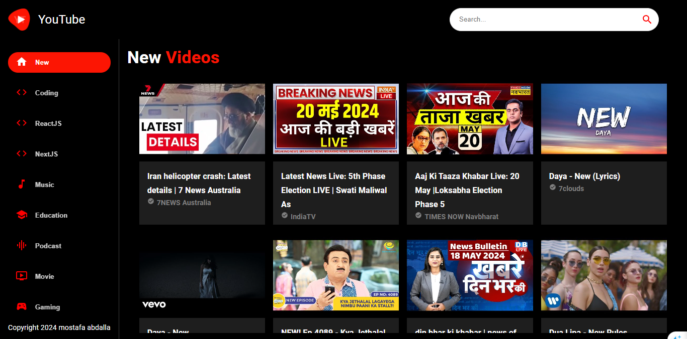

# YouTube Clone App


This is a YouTube clone web application built with React.js and Material-UI, powered by the YouTube Data API v3 from RapidAPI.

#### TVFlix Live Demo.
https://youtube-clone-coral-eight.vercel.app/

#### TVFlix Demo Screeshots.


## Features

- Search for YouTube videos.
- View video details including title, number of likes and views, and channel information.
- Watch videos directly within the app.
- Responsive design for mobile and desktop browsers.

## Technologies Used

- React.js: A JavaScript library for building user interfaces.
- Material-UI: React components that implement Google's Material Design.
- YouTube Data API v3: Used to fetch video data from YouTube.
- RapidAPI: A platform that enables developers to discover, test, and connect to APIs.

## Installation

To run this project locally, follow these steps:

1. Clone the repository:
   ```bash
   git clone https://github.com/your-username/youtube-clone.git
   ```
2. Navigate to the project directory:

   ```bash
   cd youtube-clone
   ```
3. Install dependencies:

   ```bash
   npm install
   ```
4. Create a .env file in the root directory and add your RapidAPI key:
   ```bash
   REACT_APP_RAPIDAPI_KEY=your-api-key
   ```
5. Start the development server:
   ```bash
   npm start
   ```
6. Open your browser and visit http://localhost:3000 to view the app.
